# Swellbeing
### Live App: http://swellbeing.s3-website-ap-southeast-2.amazonaws.com/
### Front-end Github Repo: https://github.com/scottodea/swellbeing-front
### Back-end Github Repo: https://github.com/scottodea/swellbeing-back

# #Table of Contents
* [About](#about-)
* [Features](#features-)
* [Installation & Setup](#installation--setup-)
* [Screenshots](#screenshots-)
* [Project Management](#project-management-)
* [User Flow](#user-flow-)
* [User Stories](#user-stories-)
* [Tools Used & Built With](#tools-used--built-with-)
* [Authors](#authors-)
* [License](#license-)
* [Honorable Mentions](#honorable-mentions-)
* [Short Questions and Answers](#questions--answers-)
* [Share](#share-our-app-)

# About [#](#table-of-contents)
It is important to keep track of the wellbeing of yourself and others in the workplace. Most would spend at least 50% of their life time on work, and people with a positive attitude work more efficiently. As an individual it is important to know if what you are doing is mentally good for you.

**Corporate use**
Swellbeing is an app where companies can subscribe and send an invitation to their employees, then your employees can take a health test and track their own results. Companies can then see the general result of all employees test results. While keeping individual anonymity.

**Personal use**
Swellbeing is an app where you can take daily wellness tests that are prepared by professionals. You can then see an evaluation of your results. The results are kept to show a historical record to show you your mental health over-time.

# Features [#](#table-of-contents)
The *primary* features of our app are the following:

* Authenticated user accounts with different access levels which persistent data
* Create randomised surveys with questions and length configurable by admin-level users, sorted into categories from our database
* Evaluate the answers(rate at %)
* Keep history of results and show results on chart
* Give some of professional advice to improve mentality
* Show admins charts of aggregate data on their users.

# Installation & Setup [#](#table-of-contents)
If you would like to have a look at the code for this website and play around with it, feel free to download it and getting it up and running by doing the following:
```
git clone https://github.com/scottodea/swellbeing-front.git
git clone https://github.com/scottodea/swellbeing-back.git
```

Then navigate to the directories from different tabs with the command lines.

```
cd swellbeing-front
cd swellbeing-back
```

Inside the 2 tabs, run the following to install all the libraries
```
npm install
```

Then create the database with command line
```
mongod --config /usr/local/etc/mongod.conf
```

You might use mongodb compass

Then lastly start it up with command line for both tabs
```
npm start
```
It should be running.
By default the server runs on Port 3000, so to view the live site on your local machine, head to [localhost:3000](http://localhost:3000), if it doesn't automatically take you there.

# Screenshots [#](#table-of-contents)

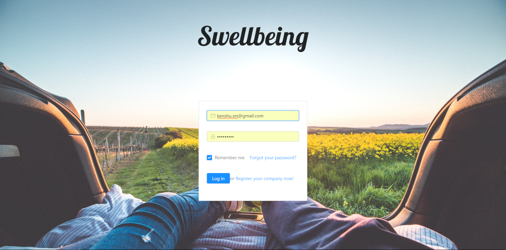
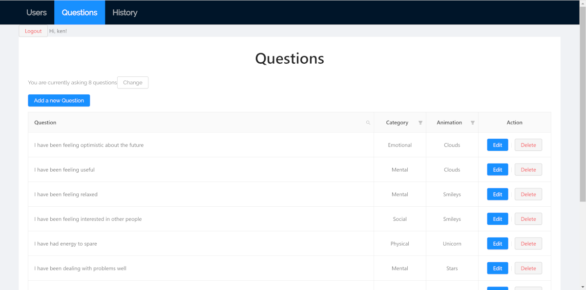
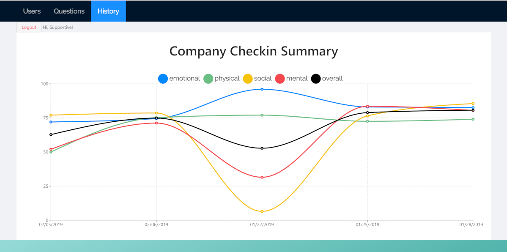
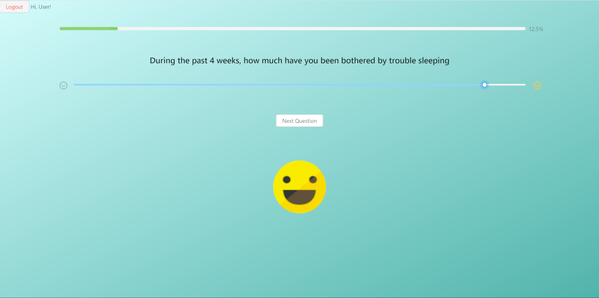
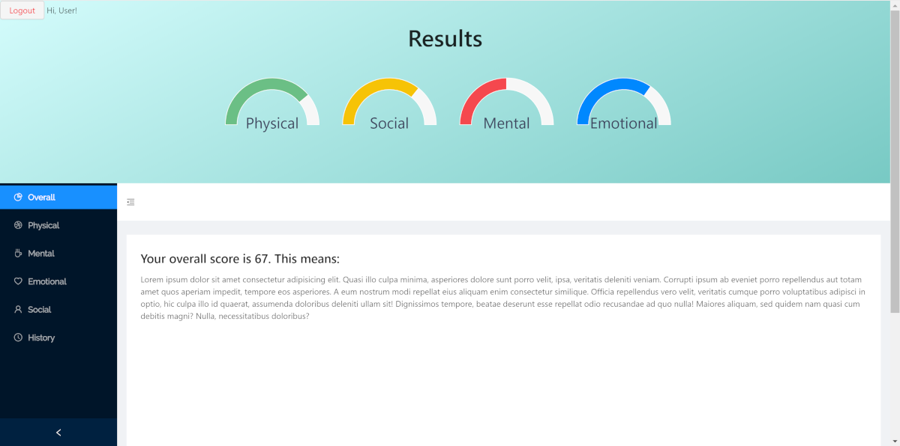

# Project Management [#](#table-of-contents)
### Wireframes
* First we thought of the best way to interact with our mental survey site. Then we sketched some wireframes and then used balsamiq, and added user flow to finalize our thoughts. Here are our Wireframes and users journey we have for Swellbeing:
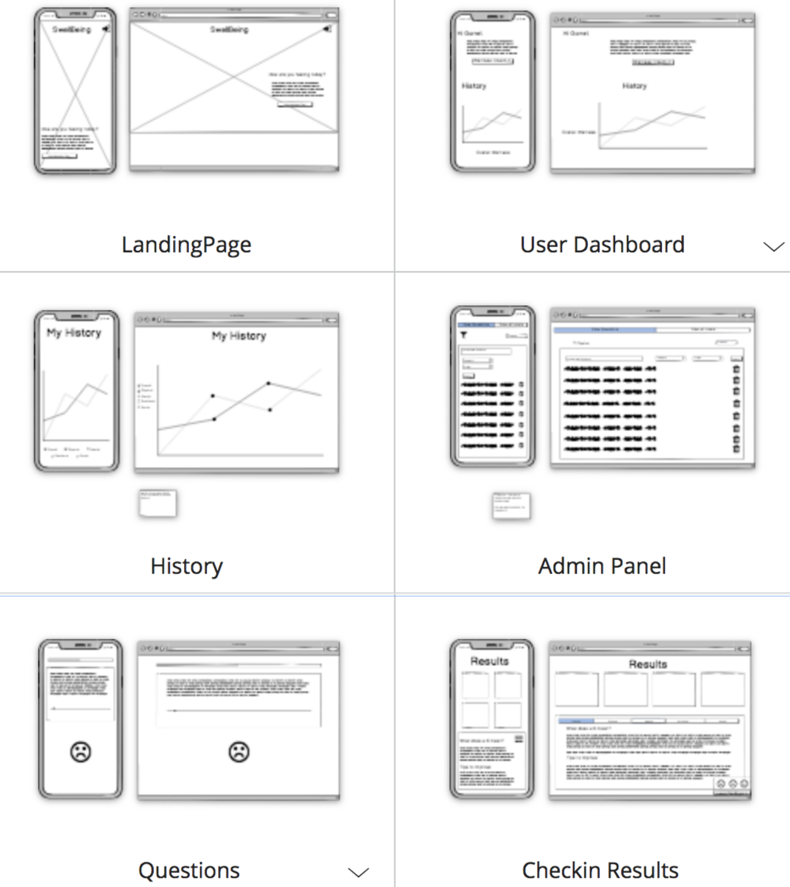
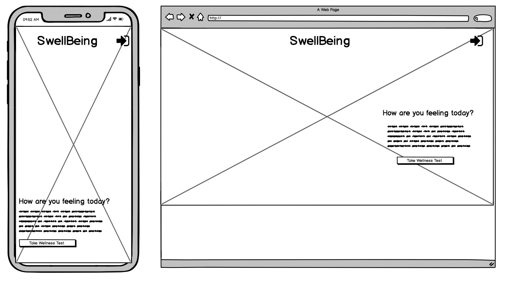
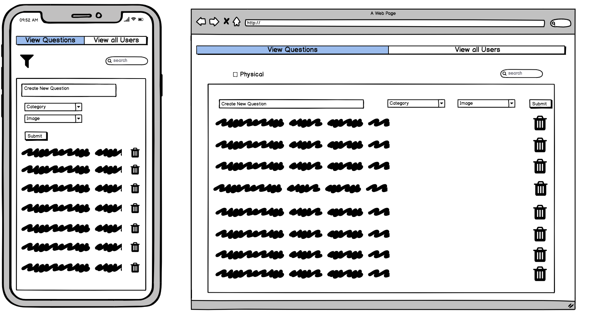
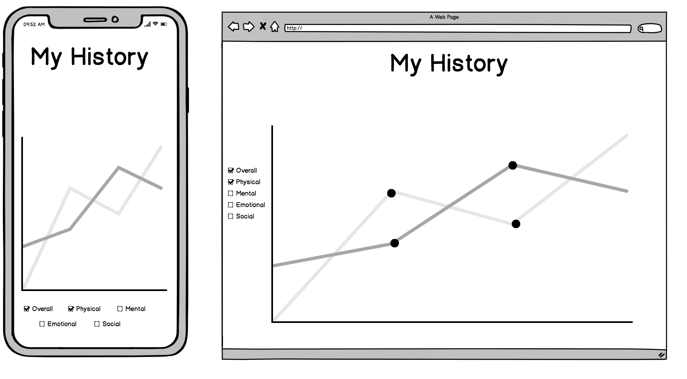
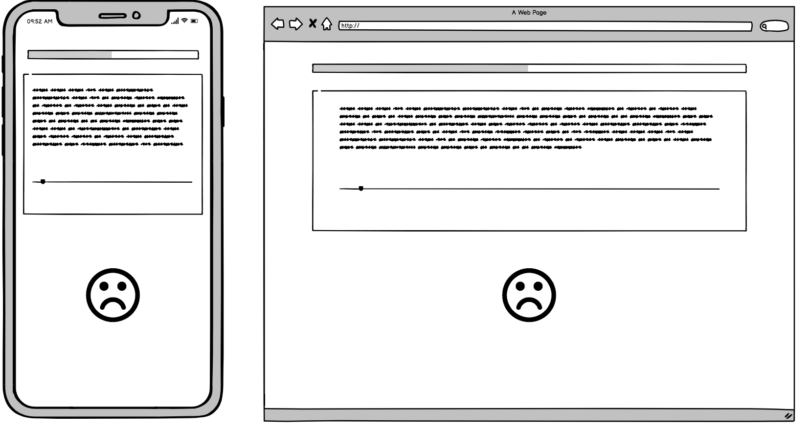
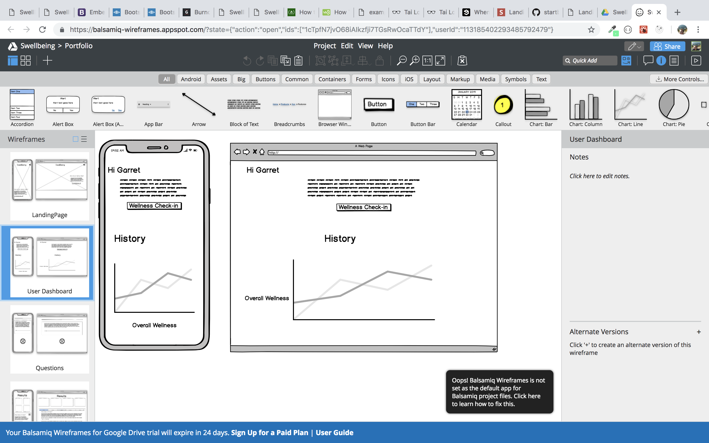
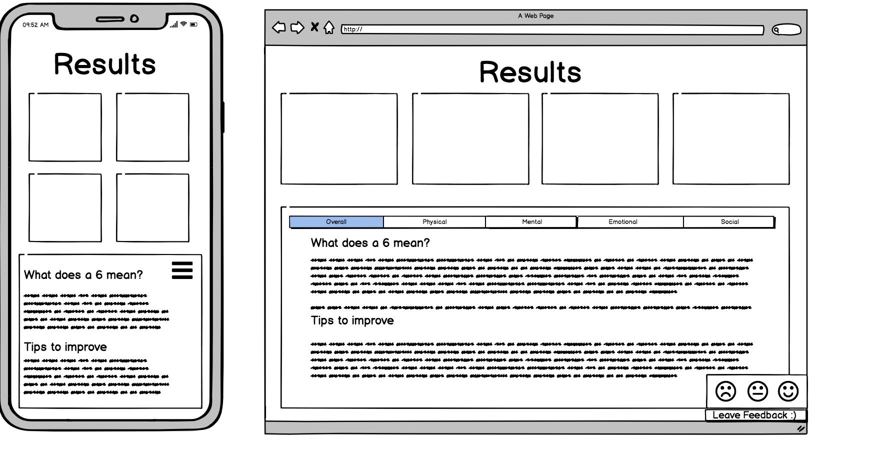

### Project Management
* While were together through most of development some days we communicated via Slack and kept a to do list on Trello

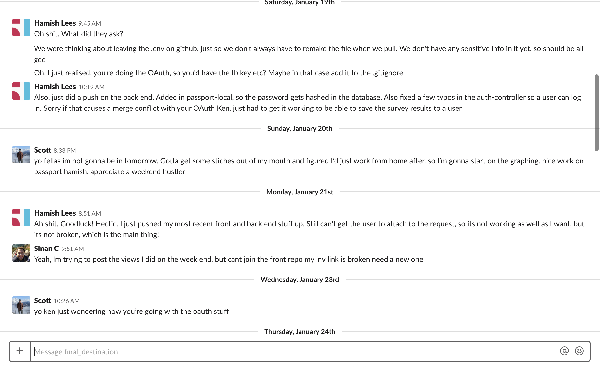

### Database
* Meanwhile drawing wireframes we sketched our non relational database plan.


### Client Communication
We met our client Ijan Kruizinga in person early on in the project to set the scope of the project as well as establish deliverables. By including our client in the design process, it ensured that our goals were aligned before any coding started. This was extremely useful, since face to face it was easier to understand the goals of our client, allowing us to change our planning of the app to be more focused on businesses. After the first few meetings, we kept in touch via email.

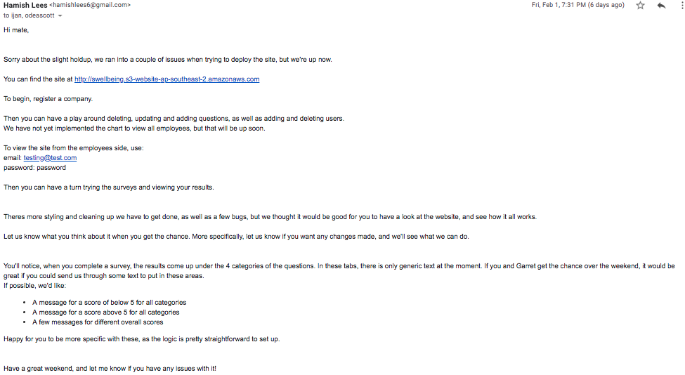

Although less information can be communicated through emails, it was still preferable due to the availability of our client.

# User Stories(Agile) [#](#table-of-contents)
Our User Stories we have made for the project:

* As a team lead, I want to be able to see the wellbeing of my employees throughout each project or task so that I can address any issues before it impacts the project.

* As an employer, I would like to track my employees' mental positivity during business changes.

* As an employee, I would like to be able to gauge my current state of being so I know whether I am currently happy.

* As an individual, I would like to view a history of my wellbeing levels so I can better understand the effects of my habits and actions.

* As a business owner, I would like to be able to easily invite and keep track of all of my employees to ensure that the results I am getting back are complete.

* As an admin, I would like to be able to update the survey's questions and length to better suit my organisation’s needs.

# Tools Used & Built With [#](#table-of-contents)
* Node.JS
* React
* Express
* Redux
* Antd
* Mongodb
* Mongodb campus
* Nodemon
* Mongoose
* Morgan
* Passport
* Cors
* Celebrate
* Sendgrid/mail
* Dotenv
* JWT
* Passport-jwt
* Passport-local
* Passport-local-mongoose
* HTML5
* CSS3
* Faker
* Heroku
* AWS
* Recharts

# Authors [#](#table-of-contents)
* [Scott O'Dea ](https://github.com/scottodea)
* [Hamish Lees](https://github.com/hamlees93)
* [Sinan Canselen](https://github.com/canselen)
* [Ken Shu](https://github.com/kenshufr)

# License [#](#table-of-contents)

*You are permitted to modify, alter, create copies, and distribute this project freely. We would love to see it expanded by other developers.

# Short Questions and Answers [#](#table-of-contents)

1.What are the most important aspects of quality software?

To build a flexible software to add, modify, remove functionality without damaging the current system. Make it readable so that we could read without confusion and complication and allow other coders to join in easily. It should be efficient, DRY and functional. The software should be scalable and accessible, while still being secure.

2.What libraries are being used in the app and why?

A library is prewritten code then helps to speed up the process of development. In our app, we used React and Express as our front-end and back-end frameworks respectively.

We chose to use React as it is a front-end library with reusable components and has a virtual DOM, which allows us to create a single-page app which only updates targeted components instead of the whole screen, benefitting both development simplicity and app performance. We used Express as an API back-end in our project as it has widespread community support, while being a light-weight framework which reinforces an MVC architecture, allowing us to practice separation of concerns and to make our code more readable.

Other libraries that are heavily used in our app include Passport for authentication, Redux for simplifying state in React and Ant Design for styling. As such, this app required many libraries to develop.

3.A team is about to engage in a project, developing a website for a small business. What knowledge and skills would they need in order to develop the project?

A team needs 3 essential capabilities to launch an application. These are: building the back-end and front-end for the application as well as deploying the app to the web and make it available to our users. For a small team, this means that they would need to be well-versed in a back-end framework and a front-end framework, such as Rails or Express / React. For deployment, they will need to be able to host their app on a platform such as Heroku, Firebase or AWS. Other key skills include proficiency in Github/ for version control, agile project management tools such as Jira or Trello and soft skills for working in a team such as effective communication and conflict resolution. Having said this, the most important skill required to develop the project would be the ability to improvise and learn new technologies.

4.Within your own project what knowledge or skills were required to complete your project, and overcome challenges?

The knowledge and skills required to complete this project can be split into the following categories:
Project management: Agile methodology and Trello
Javascript-based technologies: javascript, React, Express, npm, Redux
Databasing: MongoDB
Styling: CSS, Ant Design
Soft skills: Communication, conflict resolution, ethic, team dynamics, problem-solving


Most challenges were technical in nature, and as such it required us to be able to search for the issue online, query a classmate, read the documentation and problem solve both as an individual and in a group.

5.Evaluate how effective your knowledge and skills were this project, using examples, and suggest changes or improvements for future projects of a similar nature?

Our lessons in Javascript, React, Express, Redux and others just prior to this project were instrumental in succeeding in this project as the skills and familiarity with those technologies carried over to effectively to developing this app.

Additionally, this was the fourth major assessment so far in the course. Thus, mistakes and lessons learnt in agile methodology and better project planning were utilised in this project. Mainly, creating all of our wireframes, ERD, deploying early and planning - to a degree - the packages that we were going to use resulted in minimal rework and issues during development.

One improvement we can implement for similar future projects would be to build automated tests to minimise manual testing, and to be notified of broken code as early as possible.

# Honorable Mentions [#](#table-of-contents)
* We would like express our gratitude and appreciation by mentioning those who helped use through;
Our mentor, teachers and friends Garret Blankenship,James Lane, and James Holman.
* And community of Stackoverflow and Codewars

### Swellbeing is the ending project of Sydney Coder Academy's (2019) finishing project..

# Share Our App [#](#table-of-contents)
* [Link to website](http://swellbeing.s3-website-ap-southeast-2.amazonaws.com/)
* [Link to repository](https://github.com/scottodea/swellbeing-front)
* [Link to API repository](https://github.com/scottodea/swellbeing-back)

